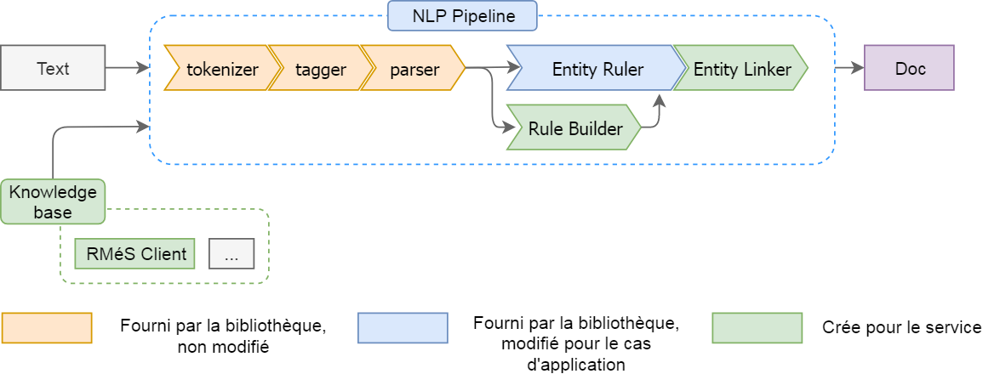

# InspaCy
[Spacy](https://spacy.io/) pipeline running `tagger`, `parser` and `Entity Ruler` components, 
packaged in a web app using [Flask](https://palletsprojects.com/p/flask/).

## Quick start
Set up a python virtual environment :
```bash
cd Inspacy
mkdir venv
python -m venv ./venv
```

Install dependencies :
```bash
source venv/bin/activate
pip isntall -r requirements.txt
python -m spacy download fr_core_news_md
```

Setup environment variables & run the app :
```bash
source init.sh
flask run
```

Go to `localhost:5000/demo` and enjoy !

## What is it ?

A Python Web App for Named Entity Recognition using [SpaCy](https://spacy.io/) !

The App is made up of three components : the **pipeline** itself, running both SpaCy 
components and custom components (in `pipe.py`), the **knowledge base** used in this pipeline, 
and the **packaging** in a web app (`inspacy.py`).

Here is a description of the pipeline :



It runs a custom component, `Rule Builder`, which takes as input an entity label, and generate
a rule used by `Entity Ruler`, to recognize the entity in texts. Rules have several levels :
* strict : match the exact entity name.
* common : match groups of words which have the same part-of-speech tags and lemmas as the entity name.
* permis : same as common, but the group of word can contains additionnal adjectives
